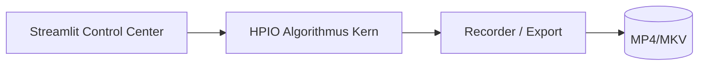
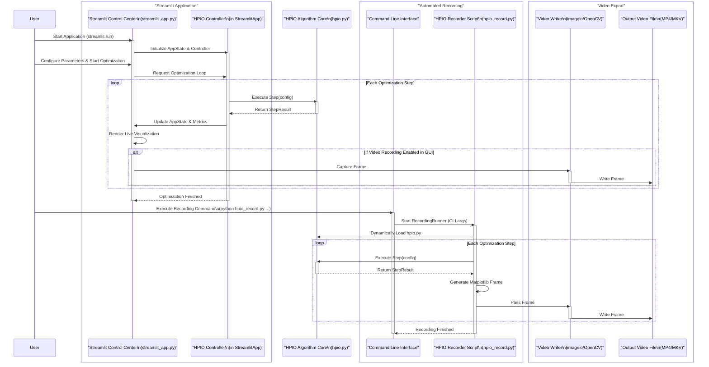

<p align="center">
  
</p>


# 🧠 HPIO Optimization Suite  
**Hybrid Phase Interaction Optimization (HPIO)** – eine architektonische Odyssee zwischen algorithmischer Präzision und visueller Intelligenz.

[](https://www.python.org/)
[](https://streamlit.io/)
[](LICENSE)
[](#)

---

> *„Jenseits des Horizonts: Der HPIO-Algorithmus und sein Kontrollzentrum – eine architektonische Odyssee.“*  
> — **Ralf Krümmel, Entwickler & Architekt**

**HPIO** ist ein hybrider Optimierungsansatz, der Agenten-Intelligenz, Feld-Interaktion und algorithmische Eleganz vereint.  
Das System kombiniert *biologisch inspirierte Schwarmdynamik* mit *numerischer Präzision* – visualisiert in einem interaktiven Kontrollzentrum, das Forschung, Analyse und Design verschmelzen lässt.

---

## 🚀 Schnellstart

### Voraussetzungen
```bash
pip install numpy pandas streamlit matplotlib imageio
# optional:
pip install pyopencl opencv-python
```

### Start
```bash
streamlit run streamlit_app.py
```
→ öffnet sich im Browser unter http://localhost:8501

### Videoaufnahme
```bash
python hpio_record.py rastrigin --video runs/rastrigin.mp4 --fps 30 --size 1280x720 --overlay
```

---

## 🧩 Hauptkomponenten

| Datei                     | Beschreibung                                                       |
| ------------------------- | ------------------------------------------------------------------ |
| `hpio.py`                 | Kern des HPIO-Algorithmus (Feld, Agenten, PSO, GA, DE)            |
| `streamlit_app.py`        | Interaktive GUI mit Live-Heatmap, Trail-Tracking und Video-Capture |
| `hpio_record.py`          | Recorder für automatisierte Videoaufnahmen                         |
| `HPIO_Commands.md`        | Befehlsreferenz mit Presets und GPU/CPU-Varianten                  |
| `manual.html`             | Benutzerhandbuch mit Installations- und GUI-Erklärung              |
| `api-documentation.html`  | Vollständige API-Dokumentation                                     |
| `project-whitepaper.html` | Architektonischer Leitfaden und Systemdesign                       |
| `diagram.svg`             | Systemübersicht (Mermaid-Diagramm)                                 |

---

## 🎛️ Features

- **Interaktive Visualisierung** mit Agenten-Trails und Heatmap  
- **Live-Parameter-Tuning** während des Laufs  
- **GPU-Beschleunigung** über PyOpenCL  
- **Video-Export (FFmpeg / OpenCV)**  
- Vergleich: **PSO**, **GA**, **DE**  
- **Early-Stopping**, **Annealing**, **Local Polish**

---

## 🧭 Interaktives Kontrollzentrum: Die Streamlit-App (`streamlit_app.py`)

Das **HPIO Control Center** ist eine vollständige Web-Anwendung zur experimentellen Optimierung, Visualisierung und Analyse. Sie nutzt modulare Seiten, klare Zustandsverwaltung (`AppState`) und ein flexibles Rendering mit Heatmaps, Video-Export und Benchmark-Tools.

### Architekturüberblick
- **AppState / Controller** – zentrale Verwaltung von Laufparametern, Logs, Metriken und Video-Frames.  
- **HPIOController** – kapselt den Optimierer (`HPIO`) und liefert pro Schritt ein `StepResult`.  
- **Session-Persistence** – Zustände bleiben via `st.session_state` erhalten.  
- **GPU-Erkennung** – automatische Prüfung auf PyOpenCL; CPU-Fallback.  
- **Heatmap-Renderer** – logarithmische Feld-Darstellung mit Agentenpfaden und Trails.  
- **Video-Engine** – `imageio`/FFmpeg, exportiert MP4/MKV/AVI mit CRF & Encoder-Preset.

### 1) Start / Run – Zentrale Steuerung
- Auswahl der **Zielfunktion** (Rastrigin, Ackley, Himmelblau) und **GPU-Toggle**.  
- Steuerung: **Seed**, **Iterationen**, **Viz-Frequenz**, **Overlay**, **Traillänge**.  
- **Kontrollen:** Start • Pause/Weiter • Stop • Schritt vor • Reset • Reset + neuer Seed.  
- **Live-Parameter-Anpassung** im Lauf: `step`, `curiosity`, `momentum`, `deposit_sigma`, `coherence_gain`, sowie `w_intensity`, `w_phase`, `phase_span_pi`.  
- Visualisierung: Heatmap mit Trails, **Status**, **Konsolen-Log**, **Parameter-Snapshot** und **Live-Chart**.

### 2) Parameter – Labor für Feineinstellungen
- **Feld**: `grid_size`, `relax_alpha`, `evap`, `kernel_sigma`  
- **Agenten & Ablage**: `count`, `step`, `curiosity`, `momentum`, `deposit_sigma`, `coherence_gain`  
- Erweiterte Steuerung: `w_intensity`, `w_phase`, `phase_span_pi`, **Annealing**, **Early-Stopping**, `polish_h`  
- **Warnungen** bei großen Grids; **Defaults** wiederherstellen; **Preset-Übernahme** vorbereiten.

### 3) Algorithmen – Vergleichende Benchmark-Suite
- **Differential Evolution (DE)**, **Particle Swarm Optimization (PSO)**, **Genetischer Algorithmus (GA)**.  
- Je Verfahren eigene Hyperparameter (Population/Schwarm, Mutation, Crossover, Inertia, Cognitive, Social, …).  
- Ergebnisse: Bestwert, beste Position, **Konvergenzdiagramme**, **CSV/JSON-Export**.

### 4) Presets – Konfigurationsmanagement
- Vorinstallierte GPU-/CPU-Presets; Import/Export eigener Presets (JSON).  
- **Diff-Ansicht** zwischen aktuellem Setup und Preset.  
- **„Copy as CLI“** – generiert reproduzierbaren `hpio_record.py`-Befehl.

### 5) Aufnahme & Export – Dokumentation & Reproduktion
- **Videoaufnahme** mit Dateiname, Format (MP4/MKV/AVI), FPS, Viz-Frequenz, Overlay, **Encoder-Preset** und **CRF**.  
- Start/Stop, Fortschrittsanzeige, Frame-Limit-Handling (5 000).  
- Artefakte: **Config (JSON)**, **Best‑Trajectory (CSV)**, **Metriken (CSV/JSON)**, **Snapshots (ZIP)**, **Logs (TXT)**.

### 6) Experimente – Batch- & Benchmark-Framework
- **Seeds-Sweep**, **Preset-Vergleich**, **Parameter-Raster** (aus Werten oder CSV-Tabelle).  
- Ergebnisse tabellarisch; **JSON-Gesamtexport**.

### 7) Hilfe / Dokumentation
- Kurzbeschreibung von HPIO (Feld Φ, Agenten, Ablage-/Relaxationsmechanismen).  
- **Parameter-Glossar**, Troubleshooting, Performance-Hinweise.

**Technische Besonderheiten:** Hot‑Reload via `trigger_rerun()`, Dataclasses & Typisierung, GPU-Fallback, modulare Seitenstruktur.

---

## 🧠 Architektur

HPIO basiert auf einer **schichtbasierten Architektur**, die im *Whitepaper* detailliert beschrieben ist:

- **Frontend (Streamlit-GUI)** – Visualisierung & Kontrolle  
- **Backend (Algorithmus-Engine)** – Optimierung & Analyse  
- **Recorder-Modul** – Persistente Aufzeichnung & Export



---

## 📘 Dokumentation

| Ressource                                      | Beschreibung                           |
| ---------------------------------------------- | -------------------------------------- |
| [🧭 Benutzerhandbuch](manual.html)             | GUI-Steuerung, Parameter, Workflows    |
| [⚙️ API-Dokumentation](api-documentation.html) | Funktionen und Klassenreferenz         |
| [📄 Whitepaper](project-whitepaper.html)       | Architektur-Philosophie & Systemdesign |
| [💡 CLI-Befehle](HPIO_Commands.md)             | Alle Presets und Aufnahme-Kommandos    |

---

## 📂 Projektstruktur
```plaintext
HPIO-Optimization-Suite/
├── hpio.py
├── hpio_record.py
├── streamlit_app.py
├── HPIO_Commands.md
├── manual.html
├── api-documentation.html
├── project-whitepaper.html
├── diagram.svg
└── runs/
```


---

### 📊 Ablaufdiagramm (System-Interaktion)



---

## 📄 Lizenz & Autor

**Autor:** Ralf Krümmel  
**Version:** 1.0 · Oktober 2025  
**Lizenz:** MIT License  
© 2025 – *Hybrid Phase Interaction Optimization (HPIO)*

> *“Optimization meets Nature – the beauty of convergence made visible.”*

---
