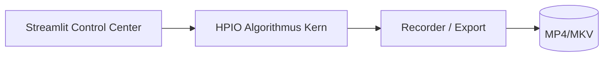

<p align="center">
  
</p>

# 🧠 HPIO Optimization Suite  
**Hybrid Phase Interaction Optimization (HPIO)** – eine architektonische Odyssee zwischen algorithmischer Präzision und visueller Intelligenz.

[](https://www.python.org/)
[](https://streamlit.io/)
[](LICENSE)
[](#)

---

> *„Jenseits des Horizonts: Der HPIO-Algorithmus und sein Kontrollzentrum – eine architektonische Odyssee.“*  
> — **Ralf Krümmel, Entwickler & Architekt**

**HPIO** ist ein hybrider Optimierungsansatz, der Agenten-Intelligenz, Feld-Interaktion und algorithmische Eleganz vereint.  
Das System kombiniert *biologisch inspirierte Schwarmdynamik* mit *numerischer Präzision* – visualisiert in einem interaktiven Kontrollzentrum, das Forschung, Analyse und Design verschmelzen lässt.

---

## 🚀 Schnellstart

### Voraussetzungen
```bash
pip install numpy pandas streamlit matplotlib imageio
# optional:
pip install pyopencl opencv-python
````

### Start

```bash
streamlit run streamlit_app.py
```

→ öffnet sich im Browser unter [http://localhost:8501](http://localhost:8501)

### Videoaufnahme

```bash
python hpio_record.py rastrigin --video runs/rastrigin.mp4 --fps 30 --size 1280x720 --overlay
```

---

## 🧩 Hauptkomponenten

| Datei                     | Beschreibung                                                       |
| ------------------------- | ------------------------------------------------------------------ |
| `hpio.py`                 | Kern des HPIO-Algorithmus (Feld, Agenten, PSO, GA, DE)             |
| `streamlit_app.py`        | Interaktive GUI mit Live-Heatmap, Trail-Tracking und Video-Capture |
| `hpio_record.py`          | Recorder für automatisierte Videoaufnahmen                         |
| `HPIO_Commands.md`        | Befehlsreferenz mit Presets und GPU/CPU-Varianten                  |
| `manual.html`             | Benutzerhandbuch mit Installations- und GUI-Erklärung              |
| `api-documentation.html`  | Vollständige API-Dokumentation                                     |
| `project-whitepaper.html` | Architektonischer Leitfaden und Systemdesign                       |
| `diagram.svg`             | Systemübersicht (Mermaid-Diagramm)                                 |

---

## 🎛️ Features

* **Interaktive Visualisierung** mit Agenten-Trails und Heatmap
* **Live-Parameter-Tuning** während des Laufs
* **GPU-Beschleunigung** über PyOpenCL
* **Video-Export (FFmpeg / OpenCV)**
* Vergleich: **PSO**, **GA**, **DE**
* **Early-Stopping**, **Annealing**, **Local Polish**

---

## 🧠 Architektur

HPIO basiert auf einer **schichtbasierten Architektur**, die in deinem *Whitepaper* detailliert beschrieben ist:

* **Frontend (Streamlit-GUI)** – Visualisierung & Kontrolle
* **Backend (Algorithmus-Engine)** – Optimierung & Analyse
* **Recorder-Modul** – Persistente Aufzeichnung & Export



---

## 📘 Dokumentation

| Ressource                                      | Beschreibung                           |
| ---------------------------------------------- | -------------------------------------- |
| [🧭 Benutzerhandbuch](manual.html)             | GUI-Steuerung, Parameter, Workflows    |
| [⚙️ API-Dokumentation](api-documentation.html) | Funktionen und Klassenreferenz         |
| [📄 Whitepaper](project-whitepaper.html)       | Architektur-Philosophie & Systemdesign |
| [💡 CLI-Befehle](HPIO_Commands.md)             | Alle Presets und Aufnahme-Kommandos    |

---

## 📂 Projektstruktur

```plaintext
HPIO-Optimization-Suite/
├── hpio.py
├── hpio_record.py
├── streamlit_app.py
├── HPIO_Commands.md
├── manual.html
├── api-documentation.html
├── project-whitepaper.html
├── diagram.svg
└── runs/
```

---

## 📸 Screenshots

---

## 📄 Lizenz & Autor

**Autor:** Ralf Krümmel
**Version:** 1.0 · Oktober 2025
**Lizenz:** MIT License
© 2025 – *Hybrid Phase Interaction Optimization (HPIO)*

> *“Optimization meets Nature – the beauty of convergence made visible.”*

```


oder möchtest du, dass ich sie gleich als **GitHub-Release-Paket (v1.0)** zusammen mit der Doku, dem Diagramm und dem Headerbild bündele?
```
