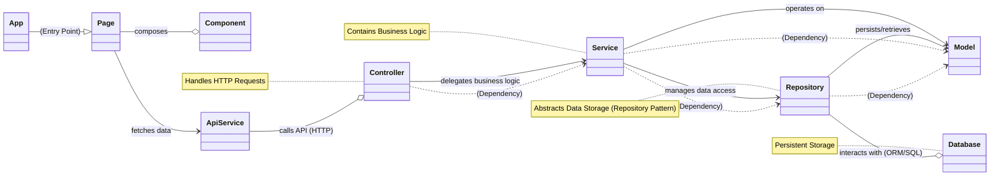

```mermaid
classDiagram
    direction LR

    subgraph Frontend
        class App
        class Page
        class Component
        class ApiService
    end

    subgraph Backend
        class Controller
        class Service
        class Repository
        class Model
        class Database
    end

    App --|> Page : (Entry Point)
    Page --o Component : composes
    Page --> ApiService : fetches data
    ApiService --o Controller : calls API (HTTP)

    Controller --> Service : delegates business logic
    Service --> Repository : manages data access
    Service --> Model : operates on
    Repository --> Model : persists/retrieves
    Repository --o Database : interacts with (ORM/SQL)

    note for Controller "Handles HTTP Requests"
    note for Service "Contains Business Logic"
    note for Repository "Abstracts Data Storage (Repository Pattern)"
    note for Database "Persistent Storage"

    Controller ..> Service : (Dependency)
    Service ..> Repository : (Dependency)
    Service ..> Model : (Dependency)
    Repository ..> Model : (Dependency)

```