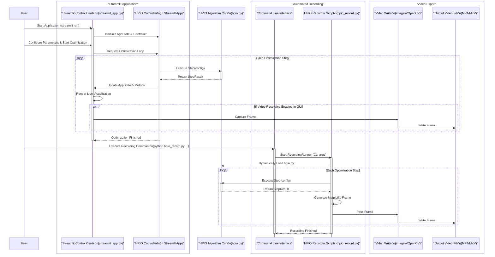

```mermaid
sequenceDiagram
    participant User
    box "Streamlit Application"
        participant StreamlitApp as "Streamlit Control Center\n(streamlit_app.py)"
        participant HPIOController_Streamlit as "HPIO Controller\n(in StreamlitApp)"
    end
    participant HPIOAlgorithm as "HPIO Algorithm Core\n(hpio.py)"
    box "Automated Recording"
        participant CLI as "Command Line Interface"
        participant HPIORecorder_Script as "HPIO Recorder Script\n(hpio_record.py)"
    end
    box "Video Export"
        participant VideoWriter as "Video Writer\n(imageio/OpenCV)"
        participant VideoFile as "Output Video File\n(MP4/MKV)"
    end

    User->>StreamlitApp: Start Application (streamlit run)
    activate StreamlitApp
    StreamlitApp->>HPIOController_Streamlit: Initialize AppState & Controller
    activate HPIOController_Streamlit
    User->>StreamlitApp: Configure Parameters & Start Optimization
    StreamlitApp->>HPIOController_Streamlit: Request Optimization Loop
    loop Each Optimization Step
        HPIOController_Streamlit->>HPIOAlgorithm: Execute Step(config)
        activate HPIOAlgorithm
        HPIOAlgorithm-->>HPIOController_Streamlit: Return StepResult
        deactivate HPIOAlgorithm
        HPIOController_Streamlit->>StreamlitApp: Update AppState & Metrics
        StreamlitApp->>StreamlitApp: Render Live Visualization
        alt If Video Recording Enabled in GUI
            StreamlitApp->>VideoWriter: Capture Frame
            activate VideoWriter
            VideoWriter->>VideoFile: Write Frame
            deactivate VideoWriter
        end
    end
    HPIOController_Streamlit-->>StreamlitApp: Optimization Finished
    deactivate HPIOController_Streamlit
    deactivate StreamlitApp

    User->>CLI: Execute Recording Command\n(python hpio_record.py ...)
    activate CLI
    CLI->>HPIORecorder_Script: Start RecordingRunner (CLI args)
    activate HPIORecorder_Script
    HPIORecorder_Script->>HPIOAlgorithm: Dynamically Load hpio.py
    loop Each Optimization Step
        HPIORecorder_Script->>HPIOAlgorithm: Execute Step(config)
        activate HPIOAlgorithm
        HPIOAlgorithm-->>HPIORecorder_Script: Return StepResult
        deactivate HPIOAlgorithm
        HPIORecorder_Script->>HPIORecorder_Script: Generate Matplotlib Frame
        HPIORecorder_Script->>VideoWriter: Pass Frame
        activate VideoWriter
        VideoWriter->>VideoFile: Write Frame
        deactivate VideoWriter
    end
    HPIORecorder_Script-->>CLI: Recording Finished
    deactivate HPIORecorder_Script
    deactivate CLI
```