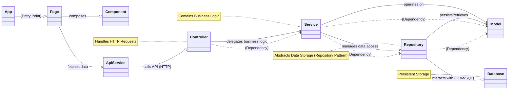

# Jenseits des Horizonts: Der HPIO-Algorithmus und sein Kontrollzentrum – Eine architektonische Odyssee

**Von:** Ralf Krümmel, der Entwickler  
**Tags:** HPIO · Optimierung · Algorithmen · Python · Streamlit · Webentwicklung · Architektur · Künstliche Intelligenz · Softwareentwicklung · Ralf Krümmel

---

Als Ralf Krümmel, Ihr Entwickler, lade ich Sie ein zu einer tiefen Erkundungsreise in die Welt der Optimierung. In einer Ära, in der Komplexität die Norm ist, suchen wir ständig nach Eleganz in der Lösung. Mein Projekt, der **Hybrid Particle‑Inspired Optimizer (HPIO)**, ist genau das: eine Brücke zwischen der Weisheit der Natur und der Präzision der Mathematik – verpackt in einem intuitiven Kontrollzentrum. Doch hinter der zugänglichen Oberfläche verbirgt sich eine robuste Architektur, die ich über Jahre hinweg verfeinert habe, um nicht nur Effizienz, sondern auch Wartbarkeit und Skalierbarkeit zu gewährleisten. Begleiten Sie mich, wie ich die Schichten dieses Systems enthülle – vom pulsierenden Kern des Algorithmus über die interaktive Benutzeroberfläche bis hin zu den fundamentalen architektonischen Prinzipien, die seine Stärke ausmachen.

## 1. Das Herzstück der Optimierung: Der HPIO‑Algorithmus (`hpio.py`)

Das Modul `hpio.py` ist die Seele des HPIO‑Optimierungsalgorithmus – meine Antwort auf die Herausforderung, globale Minima in komplexen, nicht‑konvexen Zielfunktionen zu finden. Inspiriert von der kollektiven Intelligenz natürlicher Schwärme, habe ich einen hybriden Ansatz entwickelt, der Agenten in einem dynamischen Feld interagieren lässt, um optimale Lösungen zu entdecken. Dieses Modul implementiert den Kern des HPIO‑Algorithmus sowie Hilfsfunktionen, Konfigurations‑Dataclasses und alternative Optimierungsalgorithmen wie **Differential Evolution (DE)**, **Particle Swarm Optimization (PSO)** und **Genetische Algorithmen (GA)**.

Ich habe die Struktur für die Agenten – ihre Bewegung, Neugier und Ablageverhalten – sowie das Feld, in dem sie interagieren, präzise definiert. Die Logik für die Optimierung von Zielfunktionen ist flexibel gestaltet, um eine Vielzahl von Problemen anzugehen. Für die Konfiguration habe ich intuitive Dataclasses geschaffen:

- **`FieldParams`**: Definiert Parameter für das Feld, wie `grid_size` (z. B. `(160, 160)` Pixel), `relax_alpha` (Relaxationsfaktor), `evap` (Verdampfungsrate) und `kernel_sigma` (Standardabweichung des Gaußschen Kernels).
- **`AgentParams`**: Definiert Parameter für die Agenten, darunter `count` (Anzahl der Agenten, z. B. 64), `step` (Schrittgröße), `curiosity` (Neugier‑Faktor), `momentum` (Impuls‑Faktor) und `deposit_sigma` (Breite der Feldablage).
- **`HPIOConfig`**: Die Hauptkonfigurationsklasse, die alles zusammenführt. Sie ermöglicht die Auswahl der `objective` (Zielfunktion), des `algorithm` (Standard: HPIO), `iters` (Iterationen), `seed` (Zufalls‑Seed) und vieler weiterer Parameter – einschließlich Annealing‑Faktoren für Schrittgröße und Neugier (`anneal_step_from`, `anneal_curiosity_to`) sowie Frühabbruch‑Kriterien (`early_patience`, `early_tol`).

Meine Wahl fiel auf bekannte Zielfunktionen wie `rastrigin_fn`, `ackley_fn` und `himmelblau_fn`, da sie typische Herausforderungen für Optimierer darstellen und sich hervorragend zur Leistungsbewertung eignen. Die Implementierung dieser Funktionen ist robust und dient als Benchmark für die Effektivität des HPIO‑Algorithmus. Hilfsfunktionen wie `_gaussian_kernel_1d` und `_stamp_gaussian` sorgen für die notwendige mathematische Präzision bei der Feldinteraktion.

## 2. Die Bühne für die Visualisierung: `hpio_record.py`

Um die Schönheit und Effizienz des Optimierungsprozesses nicht nur zu erleben, sondern auch festzuhalten, habe ich das Modul `hpio_record.py` entwickelt. Es ist der Chronist des HPIO‑Laufs, der jeden Schritt in ein lebendiges Video verwandelt. Bewusst habe ich mich hier **für Komposition statt Vererbung** entschieden, um die Unabhängigkeit zu wahren und sicherzustellen, dass immer die lokale, aktuellste Version des HPIO‑Kerns verwendet wird.

**Funktionale Bausteine:**

- **`load_local_hpio()`** – stellt sicher, dass die korrekte `hpio.py` dynamisch geladen wird.  
- **`VideoWriter`** – flexible Klasse zum Schreiben von Videodateien; bevorzugt FFmpeg (über Matplotlib), alternativ OpenCV. Export in **MP4/MKV**.  
- **`HPIORecorder`** – verwaltet die Visualisierung in einer Matplotlib‑Figur: links Heatmap des Feldes, rechts Konsole/Logs.  
- **`RecordingRunner`** – kapselt die HPIO‑Optimierungsschleife und integriert den Recorder; sammelt Daten und rendert Frames.

**Beispielaufruf:**

```bash
python hpio_record.py rastrigin --video runs/rastrigin.mp4 --fps 30 --size 1280x720
```

Damit sind automatisierte Aufnahmen und Batch‑Verarbeitung außerhalb der interaktiven Anwendung möglich.

## 3. Das interaktive Kontrollzentrum: Die Streamlit‑App (`streamlit_app.py`)

Der wahre Zugangspunkt zu meinem HPIO‑System ist die interaktive Streamlit‑Anwendung `streamlit_app.py`. Sie ist das **Kontrollzentrum**, das ich geschaffen habe, um vom neugierigen Studenten bis zur erfahrenen Forscherin jedem die Macht der Optimierung in die Hand zu geben.

### 3.1 Erste Schritte: Installation & Start

Voraussetzungen installieren:

```bash
pip install numpy pandas streamlit matplotlib imageio
# optional für GPU & erweiterten Video‑Export
pip install pyopencl opencv-python
```

Start der Anwendung:

```bash
streamlit run streamlit_app.py
```

Die App öffnet sich im Browser (typisch: <http://localhost:8501>).

### 3.2 GUI im Überblick

Die Anwendung ist in mehrere Seiten unterteilt (Navigation links). Der Hauptbereich zeigt den Inhalt der aktuell ausgewählten Seite – organisiert in Abschnitten, Spalten oder Tabs. Wichtige Elemente: Selectboxen, Slider, Checkboxen, Buttons.

### 3.3 HPIO starten & steuern („Start / Run“)

Hier wählen Sie **Zielfunktion** (Rastrigin, Ackley, Himmelblau), setzen Seed & Iterationen und – falls verfügbar – **GPU (PyOpenCL)**. Visualisierungseinstellungen: `viz_frequency`, `overlay` (Iteration/Bestwert) und `trail_length` der Agentenpfade.

**Run‑Kontrollen:** *Start*, *Pause/Weiter*, *Stop*, *Schritt vor*, *Reset*.  
Besonderheit: **🔄 Live‑Parameteranpassung** – `step`, `curiosity`, `momentum`, `deposit_sigma`, `coherence_gain` können **im laufenden Betrieb** verändert werden. Im Hauptbereich sehen Sie Heatmap, Agenten‑Positionen, Parameter‑Snapshot, Status und Live‑Metriken.

### 3.4 Parameter („Parameter“)

- **Feld:** `grid_width/height`, `relax_alpha`, `evap`, `kernel_sigma`  
- **Agenten & Ablage:** `count`, `step`, `curiosity`, `momentum`, `deposit_sigma`, `coherence_gain`, `w_intensity`, `w_phase`, `phase_span_pi`  
- **Annealing:** `anneal_step_from/to`, `anneal_curiosity_from/to`  
- **Frühabbruch & Polish:** `early_patience`, `early_tol`, `polish_h`

Änderungen werden über **„Übernehmen“** bestätigt und greifen zum nächsten Start/Reset.

### 3.5 Algorithmus‑Bibliothek („Algorithmen“)

Klassiker zum Vergleich: **DE**, **PSO**, **GA**. Eigene Parameter je Verfahren, Darstellung mit Bestwert, bester Position und Konvergenzdiagrammen.

### 3.6 Presets („Presets“)

Bewährte Konfigurationen laden/speichern, eigene Presets hochladen. **Diff zur aktuellen Konfiguration** und **„Copy as CLI“** generieren auf Wunsch einen Einzeiler für `hpio_record.py`.

### 3.7 Aufnahme & Export („Aufnahme / Export“)

Video‑Einstellungen (`filename`, `format`, `fps`, `encoder_preset`), sowie Exporte: **Config (JSON)**, **Best‑Trajectory (CSV)**, **Metriken (CSV/JSON)**, **Heatmap‑Snapshots (ZIP)** und **Log (TXT)**.

### 3.8 Experimente („Experimente“)

Batch‑Runs & Parameter‑Studien: *Seeds‑Sweep*, *Preset‑Vergleich*, *Parameter‑Raster*. Ergebnisse als JSON exportierbar.

### 3.9 Hilfe & Dokumentation („Hilfe“)

Einführung in HPIO, Parameter‑Glossar, Troubleshooting und Performance‑Tipps aus der Praxis.

## 4. Die architektonische Vision: Fundament moderner Webanwendungen

Während das HPIO Control Center als Streamlit‑App eine schnell entwickelte, interaktive Oberfläche bietet, basieren die Designentscheidungen auf tieferen architektonischen Prinzipien – zusammengefasst im Whitepaper zur **Schichtenarchitektur**.

### 4.1 Executive Summary

Schichtbasierte Architektur (Frontend/Backend) für robuste, skalierbare und wartbare Systeme. Klare Verantwortlichkeiten: Präsentation, Geschäftslogik, Datenzugriff.

### 4.2 Problemstellung

Monolithische Ansätze erschweren Teamarbeit und erhöhen das Fehlerrisiko. Ziel: Komplexität reduzieren, Entwicklung beschleunigen, Zukunftsfähigkeit sichern.

### 4.3 Systemarchitektur & Funktionsweise

**Frontend‑Architektur**  
- **App** – Einstiegspunkt  
- **Pages** – Routen/Ansichten  
- **Components** – wiederverwendbare UI‑Bausteine  
- **ApiService** – abstrahierte Datenkommunikation

**Backend‑Architektur**  
- **Controller** – validieren Anfragen, delegieren an Services  
- **Service** – Geschäftslogik & Orchestrierung  
- **Repository** – abstrahierter Datenzugriff  
- **Model** – Domänenobjekte / DTOs  
- **Database** – persistente Speicherung

Datenfluss: Frontend → ApiService → Controller → Service → Repository ↔ Database; Model als gemeinsame Sprache zwischen Schichten.

**Architekturdiagramm**



*Dieses Diagramm zeigt die konzeptionelle Architektur, die auch die Designentscheidungen für Anwendungen wie das HPIO Control Center leitet – selbst wenn die technische Implementierung variieren mag.*

### 4.4 Evaluation & Testergebnisse

Klare Schichten senken die Fehleranfälligkeit und erhöhen die Testbarkeit. Architektur ist für horizontale Skalierung, geringe Latenz und hohen Durchsatz ausgelegt; die GUI bleibt reaktionsschnell und nutzerzentriert.

### 4.5 Vergleich mit anderen Tools

Vorteile gegenüber starren, monolithischen Ansätzen: **Modularität**, **unabhängige Skalierbarkeit**, **bessere Wartbarkeit** und **Technologieflexibilität**.

### 4.6 Kernkonzepte & Innovationen

Konsequente Anwendung bewährter Prinzipien: **Layered Architecture**, **Repository‑Pattern**, **Model‑Driven Design**, **API‑First**.

### 4.7 Ausblick

Perspektiven: Microservices‑Migration, Event‑Driven Architecture, erweiterte Sicherheit, Cloud‑Native‑Optimierung, stärkere KI/ML‑Integration.

## 5. Fazit

Das HPIO Control Center ist mehr als ein Optimierungs‑Tool: Es zeigt, wie algorithmische Innovation und solide Software‑Architektur verschmelzen. Mein Ziel sind Werkzeuge, die **leistungsfähig**, **verständlich**, **wartbar** und **zukunftssicher** sind. Ich hoffe, diese Reise hat das Potenzial hybrider Ansätze und den Wert durchdachter Architektur greifbar gemacht.

## Quellen

- Mermaid.js (Diagramme): <https://mermaid.js.org/>
- *Design Patterns: Elements of Reusable Object‑Oriented Software* (Gang of Four)
- *Domain‑Driven Design* (Eric Evans)
- *Clean Architecture* (Robert C. Martin)

## Glossar

- **API (Application Programming Interface)** – Schnittstelle, über die Softwarekomponenten interagieren.  
- **Backend** – Serverseitiger Teil für Datenverarbeitung, Geschäftslogik und Datenbankzugriff.  
- **Controller** – Nimmt HTTP‑Anfragen entgegen und delegiert an Services.  
- **Frontend** – Clientseitige Benutzeroberfläche.  
- **HTTP (Hypertext Transfer Protocol)** – Primäres Kommunikationsprotokoll des Web.  
- **Model** – Datenstrukturen/Entitäten der Domäne.  
- **ORM (Object‑Relational Mapper)** – Bindeglied zwischen Objekten und relationalen Datenbanken.  
- **Repository‑Muster** – Abstrahiert Datenzugriff, entkoppelt Geschäftslogik von Persistenzdetails.  
- **Service** – Enthält Kern‑Geschäftslogik.  
- **UI (User Interface)** – Oberfläche zur Interaktion.  
- **UX (User Experience)** – Gesamterlebnis der Benutzung.

---

*Dieser Artikel wurde von **Ralf Krümmel**, dem Entwickler, verfasst und mithilfe von KI erstellt.*
